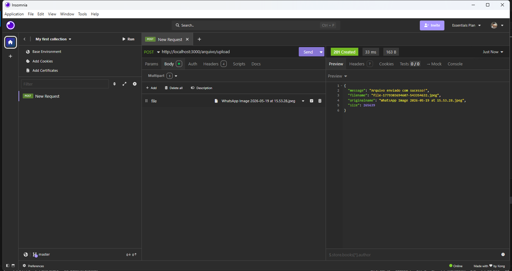
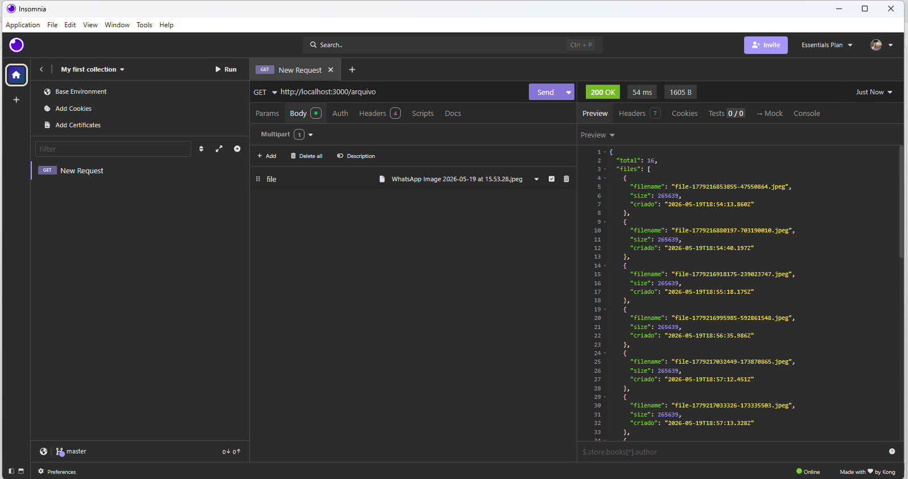
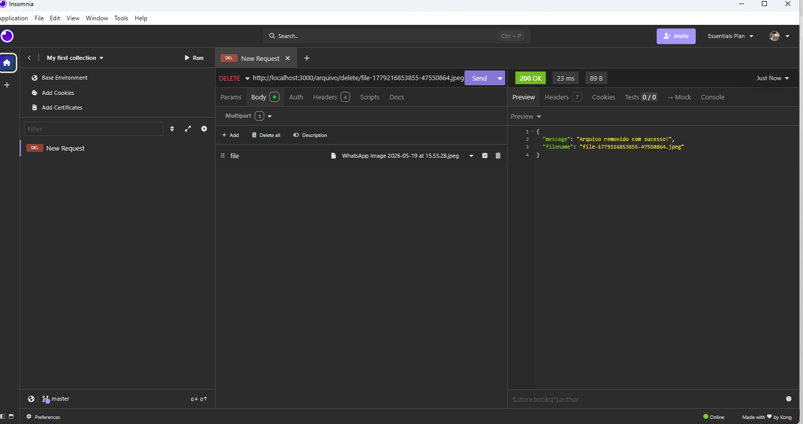

# 📁 Upload - Gerenciador de Arquivos

API desenvolvida com NestJS para upload, listagem e remoção de arquivos (apenas imagens).

---

# 👨‍💻 Autor

Lucas Borges
GitHub: https://github.com/yKraus05

---

# 🚀 Como criar o projeto (opcional)

```bash
npx npm i -g @nestjs/cli
npx nest new upload
cd upload
npx nest g resource arquivo
npm install @types/multer
⚙️ Pré-requisitos
Node.js instalado
npm ou yarn
📦 Instalação
git clone https://github.com/yKraus05/upload.git
cd upload
npm install
▶️ Rodando o projeto
npm run start:dev

A aplicação estará disponível em:

http://localhost:3000

📂 Regras de Upload
Apenas imagens são permitidas:
jpg
jpeg
png
gif
webp
Tamanho máximo: 5MB
Os arquivos são salvos na pasta /uploads
📌 Endpoints da API
📤 Upload de imagem
Método:

POST

Rota:

/arquivo/upload

Body (FormData):
Campo	Tipo
file	File
🖼️ Print do Insomnia (UPLOAD)

✅ Resposta de sucesso:
{
  "message": "Arquivo enviado com sucesso!",
  "filename": "file-123.png",
  "originalname": "foto.png",
  "size": 12345
}
❌ Erros possíveis:
{
  "statusCode": 400,
  "message": "Apenas arquivos de imagem são permitidos."
}
{
  "statusCode": 413,
  "message": "Arquivo muito grande!"
}
📂 Listar arquivos
Método:

GET

Rota:

/arquivo

🖼️ Print do Insomnia (GET)

✅ Resposta de sucesso:
{
  "total": 1,
  "files": [
    {
      "filename": "file-123.png",
      "size": 12345,
      "criado": "2026-05-20T12:00:00.000Z"
    }
  ]
}
❌ Erro:
{
  "statusCode": 400,
  "message": "Não foi possível listar os arquivos."
}
🗑️ Remover arquivo
Método:

DELETE

Rota:

/arquivo/delete/:filename

🖼️ Print do Insomnia (DELETE)

✅ Resposta de sucesso:
{
  "message": "Arquivo removido com sucesso!",
  "filename": "file-123.png"
}
❌ Erro:
{
  "statusCode": 404,
  "message": "Arquivo não encontrado."
}
🧪 Testes com Insomnia
Upload:
POST /arquivo/upload
Body: Multipart Form
Campo: file
Listar:
GET /arquivo
Deletar:
DELETE /arquivo/delete/nome-do-arquivo.png
📌 Observações
A pasta /uploads é criada automaticamente
Apenas imagens são aceitas
O nome do arquivo é gerado automaticamente